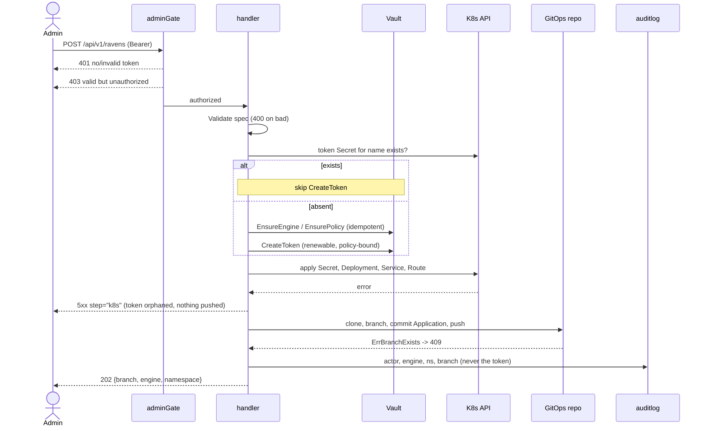
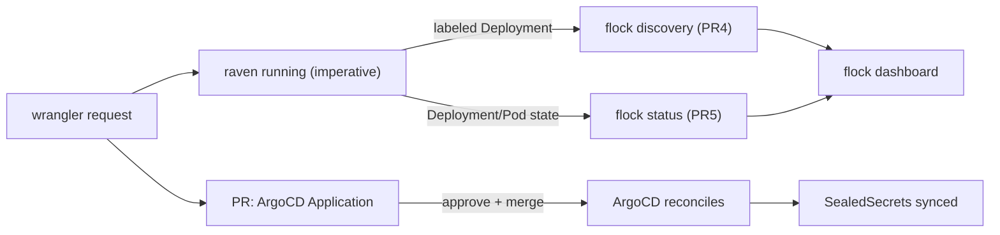

# flock-wrangler — implementation plan

Branch: `feat/flock-wrangler` (off `master`).

## Problem

Provisioning a new raven today is manual: someone hand-writes a Deployment +
Service + Route, creates a Vault engine/policy/token, and wires the new
instance into the aggregator. We want an authenticated API that does this in
one request.

## Locked design

A new **`cmd/wrangler`** binary: in-cluster, gated, mutating, privileged.
On `POST /api/v1/ravens` it:

1. **Vault** (HTTP API) — enable the secret engine, write the policy, create a
   renewable token.
2. **Kubernetes** (client-go) — create the token `Secret`, then the
   `Deployment`, `Service` and `Route`. All stamped with
   `managedBy=flock-wrangler` plus `target` / `engine` annotations.
3. **Git** — push a branch containing **only** an ArgoCD `Application`, which
   (once a human merges the PR) syncs the SealedSecrets the raven harvests
   into the namespace.

Key properties:

- The raven runs **immediately**. The PR only gates ArgoCD syncing its
  SealedSecrets — approval/merge is out of scope for this service.
- Deployment/Service/Route are **never** rendered to git; they exist only
  in-cluster. The Application is the sole file that reaches the repo.
- The Vault token is delivered as a **plain `Secret`** (not a SealedSecret) —
  nothing secret goes to git.
- **Git push is last.** An unpushed branch is the cheapest thing to omit on
  failure; a leaked Vault token is the most expensive.
- Partial failure leaves a documented orphan (no rollback saga), but the
  request is **idempotent** so retries do not accumulate Vault tokens.
- **A name in a namespace is claimed once.** Preflight refuses to provision
  over an existing Deployment (409), so a live raven is never repointed at a
  different repository or engine by a stray POST. `"force": true` replaces it:
  the Deployment, Service and Route are deleted immediately before Apply, once
  every stage that could still fail has passed. The token Secret survives, so
  the recreated raven reuses its Vault credential.

`flock` stays read-only and credential-free. It later gains optional
Kubernetes discovery + deploy-status reporting (deferred PRs 4 and 5).

### Packages

- `internal/provision` — pure: `RavenSpec` + `Validate`, `DefaultRouteHost`,
  `RenderApplication`, `Render` → `[]File`, and `Publisher` (git branch).
- `cmd/wrangler` — `main`/`run`/`NewServer`/`addRoutes`, the gate, the
  handler, and the Vault + Kubernetes implementations.

### Shared contracts (exported from `internal/provision`)

Compile-time contract between wrangler (writer) and flock (reader):

- `LabelManagedBy = "managedBy"`, `ManagedByWrangler = "flock-wrangler"`
- `AnnoTarget = "flock-wrangler/target"` — raven URL, stamped at creation so
  flock never has to read Routes
- `AnnoEngine = "flock-wrangler/engine"`

### Seams

`VaultProvisioner` (EnsureEngine / EnsurePolicy / CreateToken) ·
`ClusterApplier` (Secret/Deployment/Service/Route) · `Publisher` (concrete,
functional options) · `Authorizer` (claims → allow).
`RavenSpec` is a DTO — no functional options on it.

## Diagrams

### Create request



### Two reconcile loops after the request



## TDD cycles

MVP is PRs 1-3. PRs 4-5 are deferred follow-ups.

### PR 1 — `internal/provision` (pure)

| Cycle | Behaviour |
| --- | --- |
| A1 | `Validate` rejects bad name/namespace/engine/image (host optional) |
| A2 | `DefaultRouteHost` derives `<name>-<ns>.<clusterDomain>` when host empty |
| B1 | `RenderApplication` golden: argoproj.io/v1alpha1, source repo+path, destination ns |
| B2a | `Render` returns exactly one file — the Application (no manifests leak to git) |
| B2b | `Render` short-circuits on an invalid spec |
| C1 | `Publisher` commits files on branch `raven/create-<name>` (bare `file://` remote, injected clock+author) |
| C2 | `Publisher` pushes the branch to the remote |
| C3 | Temp clone removed on success *and* error |
| C4 | Pre-existing branch -> `ErrBranchExists` |
| C5 | SSH transport built with a host-key callback (config seam, not `file://` behaviour) |

### PR 2 — `cmd/wrangler`: Vault + Kubernetes

| Cycle | Behaviour |
| --- | --- |
| D1 | `EnsureEngine` mounts KV, idempotent (in-process Vault test cluster) |
| D2 | `EnsurePolicy` writes policy, idempotent |
| D3 | `CreateToken` returns a renewable token bound to the policy |
| E1 | Apply token `Secret` with `managedBy` label |
| E2 | Apply `Deployment`: image, `VAULT_TOKEN` via `secretKeyRef`, label + annotations, token never inline |
| E3 | Apply `Service` |
| E4 | Apply `Route` via `NewSimpleDynamicClientWithCustomListKinds` (GVK set) |
| E5 | Re-apply existing resource -> no error (shared `createOrIgnoreExists`) |

### PR 3 — `cmd/wrangler`: handler, gate, wiring

| Cycle | Behaviour |
| --- | --- |
| F1 | Unauthenticated POST -> 401 (e2e via `run`) |
| F1b | Valid token, unauthorized subject -> 403 |
| F2 | Authorized POST orchestrates Validate -> Vault -> K8s -> push -> audit, 202 |
| F2b | Re-POST existing raven does not mint a new token |
| F3a-d | invalid spec 400 · malformed JSON 400 · wrong method 405 · oversized body 413 |
| F4 | K8s failure: token minted, git NOT pushed, error names the step |
| F5 | Audit entry actor+engine+ns+branch; token value never logged |
| F6 | `run()` builds real deps from env; missing config -> error |
| F7 | Cancelled request context aborts before push |

### PR 4 (deferred) — flock discovery

G1 list ravens from labelled Deployments (target from annotation, no dynamic
client) · G2 merge into Snapshot inside the existing refresh goroutine ·
G3 discovered raven appears in `GET /api/v1/ravens` · G4 clientset built only
when enabled, graceful when absent.

### PR 5 — flock deploy status

H1 Deployment ready/replicas/conditions · H2 pod failure reasons
(`ImagePullBackOff`, `CrashLoopBackOff`) · H3 `GET /api/v1/ravens/{name}/deployment`
· H4 consider collapsing flock deps into a struct before `addRoutes` grows further.

**Sourced from wrangler, not from a Kubernetes client in flock.** flock polls
HTTP endpoints and holds no cluster credentials, so it can run outside the
cluster; wrangler is in-cluster with a clientset already. Wrangler serves the
status ungated (it exposes no secrets, only whether the thing runs) and flock
proxies it per request rather than polling, since it is a point query for one
raven. Unconfigured wrangler yields 503, unreachable yields 502 — the same
shape as the rollout feed.

Wrangler provisions into and reads status from `WRANGLER_NAMESPACE` (default
`ssg`) only. Callers do not supply a namespace; wrangler holds RBAC in exactly
one, so the field had only ever had one legal value. Nothing it does is
cluster-scoped, so a single namespaced **Role** covers it:

| resource | verbs |
| --- | --- |
| `deployments` | create, get, list, delete |
| `services` | create, get, list, delete |
| `secrets` | create, get |
| `serviceaccounts` | get |
| `pods` | list |
| `route.openshift.io/routes` | create, delete |

H4 is now due: `addRoutes` takes 11 parameters and `NewServer` 10.

## Decisions

1. **Vault policy is read-only.** Raven never writes to Vault — every
   `Logical().Write` in the repo is in a test. The policy grants exactly what
   `GetAllKVs`, `IterateList` and `GetSingleKV` need:

   ```hcl
   path "<engine>/metadata"   { capabilities = ["list"] }
   path "<engine>/metadata/*" { capabilities = ["list", "read"] }
   path "<engine>/data/*"     { capabilities = ["read"] }
   ```

   `lookup-self` / `renew-self` come from the `default` policy.

   Tokens are long-lived: 20 years (`175200h`). Vault silently truncates an
   over-long TTL to the system `max_lease_ttl` and reports it only as a
   warning — `ExplicitMaxTTL` does **not** override it. `CreateToken`
   therefore verifies the granted TTL and revokes the token rather than
   returning one that would expire in 32 days on a Vault whose
   `max_lease_ttl` has not been raised.

2. **AuthZ is a required OAuth2 scope** (`WRANGLER_REQUIRED_SCOPE`, e.g.
   `raven:provision`) checked against the space-delimited `scope` claim.
   The audience stays what it is — proof the token was minted for wrangler —
   rather than doubling as the authorisation grant. Scope was chosen over
   Keycloak's `resource_access` roles because it is flat, standard, and not
   keyed by client ID, so an audience mapper cannot silently sever the lookup.
   The caveat is that the scope must be a *default* client scope, or a caller
   that does not request it gets a valid token that 403s.

   Note `auth.AuthMiddleware` discards the claims, so the wrangler needs its
   own middleware that puts `*auth.Claims` into the request context —
   required by both F1b (403) and F5 (audit actor).

3. **Two repositories, only one of them configuration.**
   - *Per raven* — `RavenSpec.RepoURL`, the sealed-secrets repo this raven
     pushes to (one per environment: `sealedsecrets-dev.git`,
     `sealedsecrets-int.git`, …). Feeds both the Deployment's `REPO_URL` env
     var and the Application's `spec.source.repoURL`.
   - *Wrangler config* — a **separate ArgoCD repo** where the Application is
     committed for review, plus its base branch.

   The synced path is derived, not configured: `RavenSpec.SealedSecretsPath()`
   returns `declarative/<DestEnv>/sealedsecrets`, matching
   `internal/helpers`. Keying it on `SecretEngine` would produce an
   Application that syncs a directory raven never writes to, failing silently
   as an empty app.

4. **One `CLUSTER_DOMAIN` env var.** Every existing route follows
   `<name>-<namespace>.<domain>` on a single shared domain, and a wrangler
   instance is per-cluster.

5. **Wrangler creates the sealed-secrets repository (`repo` stage).**
   Enabled by `WRANGLER_BITBUCKET_URL` + `WRANGLER_BITBUCKET_TOKEN`; absent,
   the stage is skipped and repositories stay a manual prerequisite.

   - *`repoURL` stays caller-supplied, never derived.* Live deployments do not
     follow a rule: `ssg-dev-to-bygg` has `SECRET_ENGINE=dev` with
     `DEST_ENV=bygg`, and `ssg-auth.dev` has `SECRET_ENGINE=auth.dev.norsk-tipping.no`
     with `DEST_ENV=dev`. A `sealedsecrets-<destEnv>` rule would point the
     latter at `sealedsecrets-dev` — an existing repository belonging to a
     different raven, silently adopted.
   - *Create-or-adopt, never delete.* `GET` then `POST`, tolerating 409 on
     both the repository and the access key: Bitbucket rejects a key that
     already grants access with `DuplicateSshKeyException`, so "ensure" and
     "create" are the same call. Only that exception is tolerated — the 409
     for a key bound to an account is a refusal, and swallowing it leaves a
     repository with no grant at all. A retry that lands on a populated
     repository must not destroy the secrets already in it. Archived
     repositories are refused rather than adopted, since they accept no
     pushes.
   - *Two identities, two mechanisms.* Raven's key belongs to a Bitbucket
     account, and Bitbucket refuses to register an account's key as a
     repository access key, so that account is granted `REPO_WRITE` directly
     via `WRANGLER_BITBUCKET_USER`. ArgoCD reads with its own standalone key,
     registered as a `REPO_READ` access key from `WRANGLER_ARGOCD_READER_KEY`.
     This mirrors how the existing `sealedsecrets-*` repositories are already
     set up. Without the read grant the Application cannot sync what raven
     pushes.
   - *Seeding goes over git, not HTTP.* Bitbucket's file-write API rejects
     project- and repository-scoped access tokens ("do not have a valid user
     associated"), so the initial commit is a go-git push of `.gitkeep` at
     `SealedSecretsPath()`. Without it raven's clone fails on an empty
     repository and ArgoCD has no path to sync.
   - *Ordered before `vault`.* A repository failure then cannot leave a minted
     token behind.

## Open questions

- Base branch name in the ArgoCD repo (assumed `master`, configurable).
- The shared raven key accumulates write access to every sealed-secrets
  repository, with no per-raven revocation. Per-raven keypairs would fix it at
  the cost of a Secret per raven.
- Who owns the `{name}-cleaner` ServiceAccount: wrangler creates it in `ssg`,
  or it ships in git beside the target-namespace RoleBinding it is useless
  without.
- OIDC audience and scope names for `auth.dev.norsk-tipping.no`. The verifier
  matches the standard space-delimited `scope` claim exactly and treats the
  audience as the OIDC client ID.
- Reporting rollout status back onto the approval PR (Bitbucket build-status
  API). Wrangler pushes a branch today and does not open the PR.

## Settled for the first deployment

- Vault: long-TTL service token in a Secret. No renewer, so an expired token
  surfaces as a failing vault stage until the Secret is replaced.
- TLS: edge-terminated Route. Wrangler itself serves plaintext.
- Bitbucket: enabled, so the repo stage runs.
- Existing ravens get `managedBy=flock-wrangler` backfilled so flock sees them.

## Risks

- The wrangler concentrates three capabilities: Vault admin token, Kubernetes
  create rights, git push key. Mitigations: explicit enable flag, OIDC authZ
  (F1b), audit (F5), token never logged, git push last (F4).
- The Bitbucket token needs repository-creation rights across the project.
  Bitbucket has no narrower "may create repositories" permission, so the
  blast radius covers every existing sealed-secrets repository. A dedicated
  project for wrangler-created repositories would bound it.
- Orphan-on-partial-failure is accepted for the MVP; F2b prevents
  accumulation across retries.
- Concurrent POSTs for the same name can still race; the idempotency guard
  covers the common case, a per-name lock is a follow-up.
- A forced recreate deletes with background propagation and recreates a few
  stages later. If the old Deployment has not yet cleared, Apply tolerates the
  AlreadyExists and the recreate silently no-ops. A wait loop is the fix if it
  is ever observed.
- Pre-existing ravens do not carry `managedBy=flock-wrangler`, so discovery
  (PR 4) finds only wrangler-created ravens until the label is backfilled.
